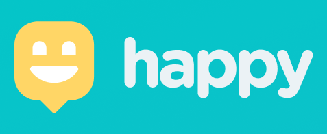
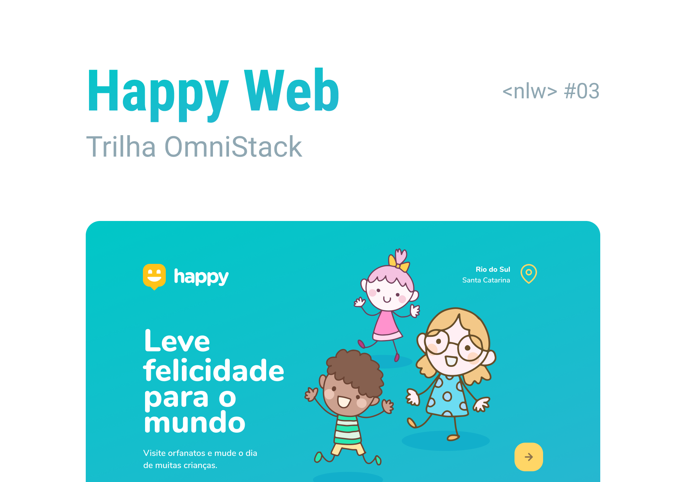

<h1 align="center">
<br>
  
<br>
<br>
Happy
</h1>

<p align="center">Aplicação desenvolvida para facilitar a busca por orfanatos e agendar visitas a eles.</p>

<div>
  
</div>

# 📋 Índice

- [Sobre o projeto](#-Sobre-o-projeto)
- [Tecnologias utilizadas](#-Tecnologias-utilizadas)
- [Rodando o projeto](#-Rodando-o-projeto)
  - [Pré-requisitos](#-Pré-requisitos)
  - [Rodando o server](#-Rodando-o-server)
  - [Rodando a versão web](#-Rodando-a-versão-web)
  - [Rodando o aplicativo mobile](#-Rodando-o-aplicativo-mobile)

## 📃 Sobre o projeto

Projeto desenvolvido durante a terceira edição da Next Level Week da Rocketseat, desenvolvida com intuito de facilitar a busca por orfanatos e suas informações gerais como horário de atendimento, localização e fotos. A aplicação foi desenvolvida utilizando backend em node, frontend em react e aplicativo mobile em react native.

## 🛠 Tecnologias utilizadas

- ⚛️ **React Js** — Front-end web
- ⚛️ **React Native** — Aplicativo mobile
- 💹 **Node Js** — Back-end
- 🎲 **Typeorm** — Comunicação do back-end com o banco de dados

## 🚀 Rodando o projeto

A aplicação é dividida em três partes, web, mobile e server, a versão web e o aplicativo mobile precisam que o server esteja sendo executado para funcionar.

### Pré-requisitos

- Git
- NodeJS
- Expo

### 💻 Rodando o server

Clone o repositório

```bash

# Clona o repositório
git clone https://github.com/thiagosprestes/Happy-next-level-week-3

```

Navegue até a pasta do projeto clonado e execute os comandos abaixo

```bash

# Entra na pasta do server
cd backend

# Inicia o server
yarn dev

# Acesse http://localhost:3333 para acessar o servidor caso deseje

```

### 🖥 Rodando a versão web

Caso já tenha clonado o repositório basta pular a primeira etapa

```bash

# Clona o repositório
git clone https://github.com/thiagosprestes/Happy-next-level-week-3

```

Navegue até a pasta do projeto clonado e execute os comandos abaixo

```bash

# Entra na pasta da versão web
cd web

# Instala as dependências
yarn

```

Após concluir a instalação das dependências execute o comando

```bash

# Inicia a versão web
yarn start

# Acesse http://localhost:3000 para utilizar a aplicação

```

Com seu smartphone escaneie o QR code que aparece no terminal utilizando o Expo, app que está disponivel na App store e na Play store para iniciar o aplicativo.

### 📱 Rodando o aplicativo mobile

Caso já tenha clonado o repositório basta pular a primeira etapa

```bash

# Clona o repositório
git clone https://github.com/thiagosprestes/Happy-next-level-week-3

```

Navegue até a pasta do projeto clonado e execute os comandos abaixo

```bash

# Entra na pasta do aplicativo
cd mobile

# Instala as dependências
yarn

```

Após isso, no terminal da pasta mobile execute o comando abaixo

```bash

# Inicia o aplicativo
expo start

```

Com seu smartphone escaneie o QR code que aparece no terminal utilizando o Expo, app que está disponivel na App store e na Play store para iniciar o aplicativo.
